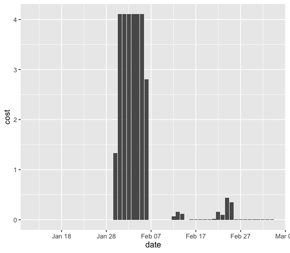
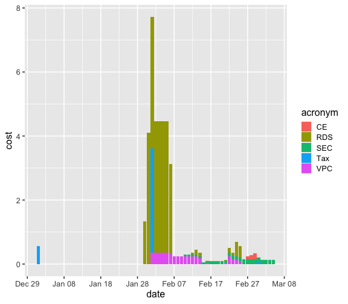

Load libraries


``` r
library(sixtyfour)
library(dplyr)
library(ggplot2)
library(lubridate)
```

Get data for the past approximately 13 months


``` r
start_date <- today() - months(13)
my_data <-
  aws_billing(date_start = start_date)
```

Simple plot of RDS spend through time


``` r
rds_by_day <-
  my_data %>%
  filter(
    id == "blended",
    service == "Amazon Relational Database Service"
  ) %>%
  mutate(date = as.Date(date))

ggplot(rds_by_day, aes(date, cost)) +
  geom_col() +
  scale_x_date(date_breaks = "10 days", date_labels =  "%b %d") +
  theme_grey(base_size = 16)
```



Plot of all types with cost greater than zero though time


``` r
all_by_day <-
  my_data %>%
  filter(id == "blended") %>%
  group_by(service) %>%
  filter(sum(cost) > 0)  %>%
  mutate(date = as.Date(date))

ggplot(all_by_day, aes(date, cost)) +
  geom_col(aes(fill = acronym)) +
  scale_x_date(date_breaks = "10 days", date_labels =  "%b %d") +
  theme_grey(base_size = 16)
```


